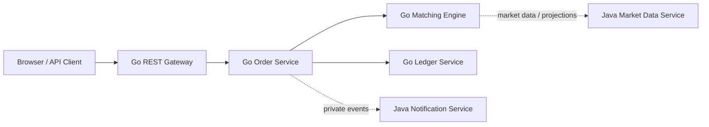
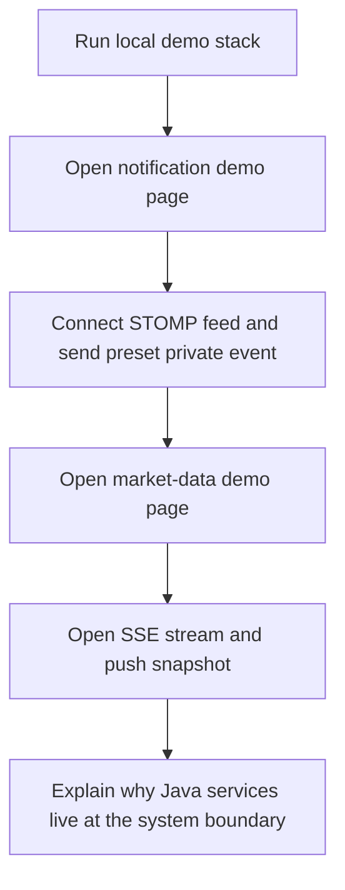
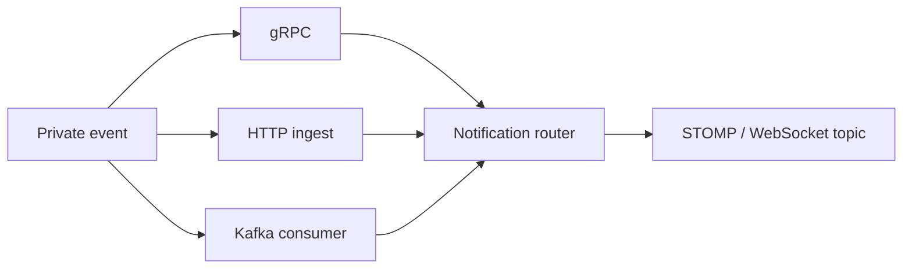
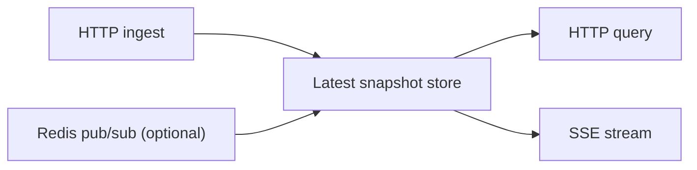

# Trading System Demo

A portfolio-grade exchange system demo with a Go-first execution core and Java/Spring Boot boundary services.

## What this project is

This repository explores how to build an exchange-style trading system with clear service ownership and explainable architecture.

The current shape is intentionally polyglot:

- Go owns execution-critical domains such as order flow, matching, and ledger boundaries.
- Java/Spring Boot is used for boundary services where framework integration is a strength:
  - private notification fan-out
  - public market-data read-side delivery

The goal is not just to "make something run", but to make the system easy to explain in a portfolio, interview, or architecture discussion.

## Architecture at a glance



## Current highlights

- Go workspace with separate service modules instead of one monolithic Go module
- Internal gRPC boundaries between Go services
- Java 21 virtual-thread based Spring Boot services
- `notification-service-java` for private event intake and WebSocket/STOMP fan-out
- `market-data-service-java` for public snapshot query and SSE fan-out
- Built-in browser demo pages for both Java services
- Split docs, schema notes, and method index for low-friction navigation

## Fastest demo path

From the repo root:

```bash
cd /Users/adam/trading_system
./scripts/java/run_portfolio_demo.sh
```

Then open:

- `http://127.0.0.1:8094/demo/private-feed.html`
- `http://127.0.0.1:8095/demo/market-data.html`

Stop them with:

```bash
./scripts/java/stop_portfolio_demo.sh
```

## Portfolio demo flow



## Live walkthrough

Recommended order:

1. Start the local Java demo stack.
2. Show `notification-service-java` first.
3. Show `market-data-service-java` second.
4. Close by explaining why Java lives at the system boundary while Go keeps the execution-critical path.

This sequence works well because the private feed demo feels interactive immediately, and the market-data demo then reinforces the read-side architecture.

## Demo services

### Notification Service

Path:

- `services/notification-service-java`

What it shows:

- gRPC private event intake
- HTTP fallback ingest for local demos
- Kafka consumer path for a more production-like event edge
- user-specific STOMP/WebSocket fan-out
- Java 21 virtual threads for request-oriented concurrency



Suggested live steps:

1. Open `http://127.0.0.1:8094/demo/private-feed.html`
2. Click `Connect Feed`
3. Keep the default user id
4. Pick a preset such as `Trade Preset`
5. Click `Send Demo Event`
6. Show the private feed updating immediately

Suggested talking points:

- This is a Java 21 + Spring Boot boundary service rather than a core matching component.
- It accepts private events through gRPC, HTTP fallback, and Kafka consumer paths.
- It routes those events into user-scoped STOMP/WebSocket topics.
- Virtual threads keep the request-handling model straightforward without forcing callback-heavy code.

### Market Data Service

Path:

- `services/market-data-service-java`

What it shows:

- HTTP snapshot ingest
- HTTP snapshot query
- SSE public stream
- optional Redis pub/sub intake
- Java 21 virtual threads for public read-side handling



Suggested live steps:

1. Open `http://127.0.0.1:8095/demo/market-data.html`
2. Click `Open SSE Stream`
3. Click `Send Demo Snapshot`
4. Point out that the quote tiles update from the streaming event
5. Click `Load Snapshot` to show the read model is queryable over HTTP

Suggested talking points:

- This service is also Java 21 + Spring Boot, but optimized for public read-side delivery.
- It uses native SSE because the public market-data case is one-way fan-out.
- It supports HTTP ingest, HTTP query, SSE delivery, and optional Redis pub/sub intake.
- This is the kind of service where Spring Boot ergonomics and integration support are a strong fit.

## Interview summary

If someone asks why the project mixes Go and Java:

- Go remains responsible for execution-critical ownership domains such as order flow, matching, and ledger boundaries.
- Java is used for service edges where framework integration matters more than ultra-low-level control.
- The system is polyglot by service boundary, not by mixing runtimes inside one component.

If time is short, the one-minute version is:

- The core exchange write path is Go.
- I added two Java Spring Boot services as portfolio-quality boundary services.
- One handles private notifications over WebSocket/STOMP.
- One handles public market data over SSE.
- Both are Java 21, both use virtual threads, and both are demoable from built-in browser pages.

## Repo layout

```text
go.work
modules/
  exchange-core-go/
services/
  rest-gateway-go/
  order-service-go/
  matching-engine-go/
  ledger-service-go/
  ws-gateway-go/
  replay-tool-go/
  notification-service-java/
  market-data-service-java/
docs/
scripts/
deployments/
```

## Useful scripts

- `./scripts/java/run_portfolio_demo.sh`
- `./scripts/java/stop_portfolio_demo.sh`
- `./scripts/java/test_notification_service.sh`
- `./scripts/java/test_market_data_service.sh`
- `./scripts/seed/send_private_event_demo.sh`
- `./scripts/seed/send_market_data_demo.sh`

## Where to read next

- [Docs Index](/Users/adam/trading_system/docs/index.md)
- [Status Checklist](/Users/adam/trading_system/docs/features/status-checklist.md)
- [System Overview](/Users/adam/trading_system/docs/architecture/system-overview.md)
- [Service Boundaries](/Users/adam/trading_system/docs/architecture/service-boundaries.md)
- [Java Notification Service](/Users/adam/trading_system/docs/architecture/java-notification-service.md)
- [Java Market Data Service](/Users/adam/trading_system/docs/architecture/java-market-data-service.md)

## Status note

The Go write path and Java boundary services are both actively scaffolded and documented, but the repository is still evolving as a demo platform rather than claiming full production completeness.
